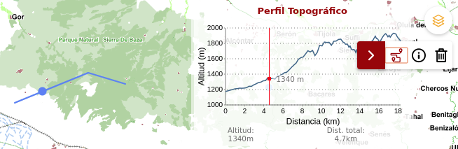

# M.plugin.Perfiltopografico

Plugin que permite realizar un perfil longitudinal en función del eje que dibujemos en pantalla



# Dependencias

- perfiltopografico.ol.min.js
- perfiltopografico.ol.min.css


```html
 <link href="../../plugins/perfiltopografico/perfiltopografico.ol.min.css" rel="stylesheet" />
 <script type="text/javascript" src="../../plugins/perfiltopografico/perfiltopografico.ol.min.js"></script>
```

# Parámetros

El constructor se inicializa con un JSON de _options_ con los siguientes atributos:

- **position**. Indica la posición donde se mostrará el plugin.
  - 'TL':top left
  - 'TR':top right (default)
  - 'BL':bottom left
  - 'BR':bottom right

# Eventos

# Otros métodos

# Ejemplos de uso

### Ejemplo 1
```javascript
   const map = M.map({
     container: 'map'
   });

   const mp = new M.plugin.Perfiltopografico();

   map.addPlugin(mp);
```
