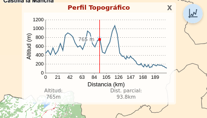

# M.plugin.Topographicprofile

Plugin que permite obtener un perfil topográfico. El cálculo de dicho perfil y el mecanismo para obtener la altura es variable:

- Existen dos modos de funcionamiento del plugin. En el modo 'interactivo' el usuario activa primeramente el plugin y después dibuja en el mapa la linea cuyo perfil topográfico quiera obtener. En el modo plugin aparece activo en el mapa, mostrando el perfil topográfico de una capa vectorial
 en función del eje que dibujemos en pantalla



# Dependencias

- topographicprofile.ol.min.js
- topographicprofile.ol.min.css


```html
 <link href="../../plugins/topographicprofile/topographicprofile.ol.min.css" rel="stylesheet" />
 <script type="text/javascript" src="../../plugins/topographicprofile/topographicprofile.ol.min.js"></script>
```

# Parámetros

El constructor se inicializa con un JSON de _options_ con los siguientes atributos:

- **position**: Indica la posición donde se mostrará el plugin.
  - 'TL':top left
  - 'TR':top right (default)
  - 'BL':bottom left
  - 'BR':bottom right
- **mode**: Existen dos comportamientos diferentes
  - interactive: El usuario activa el plugin y posteriormente dibuja en el mapa la linea cuyo perfil topográfico quiera obtener.
  - fixed: El plugin aparece activo en el mapa, mostrando el perfil topográfico de una capa vectorial
- **layer**: Capa vectorial lineal sobre la que se calculará el perfil topográfico. 
- **forcews**: Booleano que indica si, aun teniendo la capa en sus coordenadas valor de altura z que por defecto se muestra en el perfil topográfico, se desea llamar al servicio WCS para que tenga preferencia sobre dicho valor z. Por defecto, vale 'false'.
- **wcs**: Parámetros de definición del servicio WCS que se desea consultar.
# Ejemplos de uso

### Ejemplo 1
```javascript
   const map = M.map({
     container: 'map'
   });

   const mp = new M.plugin.Topographicprofile();

   map.addPlugin(mp);
```
### Ejemplo 2
```javascript
let provincias = new M.layer.GeoJSON(
  {
    name: "Provincias", 
    url: 'https://raw.githubusercontent.com/sigcorporativo-ja/topographicprofile/develop/test/1.geojson',
    extract: false
  });

layer.on(M.evt.LOAD, () => {
  const mp = new Topographicprofile({
    mode: 'fixed',
    layer: provincias,
  }
);
map.addPlugin(mp);
}